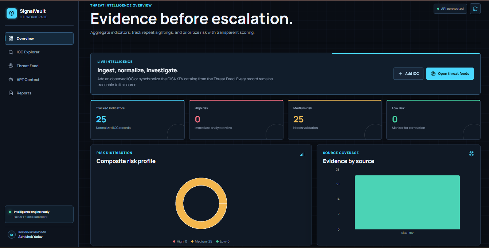
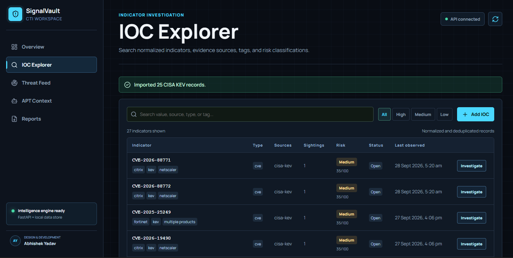
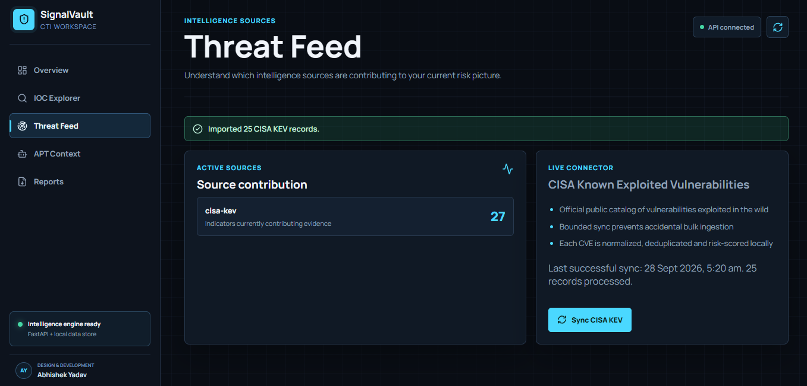

# SignalVault CTI

> A local-first cyber threat intelligence workspace for ingesting, normalizing, scoring, and investigating Indicators of Compromise (IOCs).



SignalVault CTI brings evidence collection and analyst workflow into one focused workspace. It accepts manually observed IOCs, synchronizes the official CISA Known Exploited Vulnerabilities (KEV) catalog, deduplicates records, assigns transparent risk scores, and lets an analyst retain confidence, disposition, and investigation notes.

**Design and development: Abhishek Yadav**

## Highlights

- **Real intelligence ingestion** - import CVEs from the official CISA KEV JSON feed or submit an observed IOC manually.
- **IOC normalization** - supports IP addresses, domains, URLs, file hashes, and CVE identifiers.
- **Evidence-aware risk scoring** - each record has an explainable score and High, Medium, or Low risk classification.
- **Deduplication and sightings** - repeated submissions update the existing record and preserve source provenance.
- **Investigation workflow** - record analyst notes, confidence levels, and Open, Monitoring, Escalated, or Closed dispositions.
- **MITRE ATT&CK context** - maps supported IOC tags to technique coverage without making unsupported attribution claims.
- **Dashboard and exports** - review risk/source coverage and download the current investigation snapshot as JSON.
- **Local-first architecture** - FastAPI API, SQLite persistence, and a React command-center interface.

## Screenshots

| Overview | IOC Explorer |
| --- | --- |
|  |  |

| Threat Feed | APT Context |
| --- | --- |
|  |  |

## Architecture

```text
React + Vite dashboard (port 5173)
              |
              | HTTP / JSON
              v
FastAPI service (port 8000)
      |                 |
      v                 v
SQLite datastore     CISA KEV public feed
```

### Technology Stack

| Layer | Technology |
| --- | --- |
| Frontend | React 19, Vite, Recharts, Lucide React |
| Backend | Python, FastAPI, Pydantic, HTTPX |
| Persistence | SQLAlchemy with SQLite |
| Intelligence source | CISA Known Exploited Vulnerabilities catalog |

## Quick Start

### Prerequisites

- Python 3.10 or newer
- Node.js 20 or newer
- npm

### 1. Start the API

From the project root:

```powershell
python -m venv .venv
.\.venv\Scripts\Activate.ps1
pip install -r backend\requirements.txt
uvicorn backend.main:app --reload --port 8000
```

The API is available at `http://127.0.0.1:8000`, with interactive API documentation at `http://127.0.0.1:8000/docs`.

### 2. Start the frontend

Open another terminal:

```powershell
cd frontend
npm install
npm run dev
```

Open `http://127.0.0.1:5173` in your browser. The header should show **API connected** when both services are running.

## Using SignalVault

1. Open **IOC Explorer** and use **Add IOC** to enter an IP, domain, URL, hash, or CVE.
2. Include a source and meaningful tags such as `phishing`, `malware`, or `command-and-control` where applicable.
3. Open **Threat Feed** and synchronize CISA KEV records for a live, public vulnerability feed.
4. Select **Investigate** on an IOC to record an analyst note, confidence, and disposition.
5. Use **Reports** to download the current workspace data as a JSON investigation snapshot.

## API Reference

| Method | Endpoint | Purpose |
| --- | --- | --- |
| `GET` | `/api/health` | Service and database health status |
| `GET` | `/api/dashboard` | Summary metrics, source coverage, MITRE coverage, and feed status |
| `GET` | `/api/indicators` | Search and filter normalized IOC records |
| `POST` | `/api/indicators` | Create or update an IOC |
| `PATCH` | `/api/indicators/{indicator_id}/investigation` | Save analyst investigation details |
| `POST` | `/api/feeds/cisa-kev/sync` | Import a bounded number of official CISA KEV entries |

### Add an IOC

```bash
curl -X POST http://127.0.0.1:8000/api/indicators \
  -H "Content-Type: application/json" \
  -d '{"value":"example.org","source":"manual","tags":["phishing"]}'
```

### Synchronize CISA KEV

```bash
curl -X POST http://127.0.0.1:8000/api/feeds/cisa-kev/sync \
  -H "Content-Type: application/json" \
  -d '{"limit":25}'
```

The import limit is intentionally bounded between 1 and 100 records per request.

## Project Structure

```text
SignalVault-CTI/
├── backend/
│   ├── main.py              # FastAPI routes and CISA KEV synchronization
│   ├── intelligence.py      # IOC normalization, risk scoring, MITRE mapping
│   ├── database.py          # SQLAlchemy setup and migrations
│   └── models.py            # Indicator and feed-sync models
├── frontend/
│   └── src/
│       ├── App.jsx          # Dashboard and analyst workspace
│       └── App.css          # SignalVault visual system
├── screenshots/             # Product screenshots
└── docker-compose.yml       # Container configuration
```

## Security Notes

- `.env` files, virtual environments, local SQLite databases, and service-account files are excluded from Git.
- The CISA KEV connector retrieves public data over HTTPS and records the most recent successful synchronization locally.
- SignalVault does not attribute actors or campaigns from a single IOC. Analyst judgment and source provenance remain central to every investigation.
- This project is intended for academic, research, and defensive security workflows. Validate intelligence before operational decisions.

## Development

Build the frontend for production:

```powershell
cd frontend
npm run build
```

## License

This project is provided for educational and defensive cybersecurity use.
